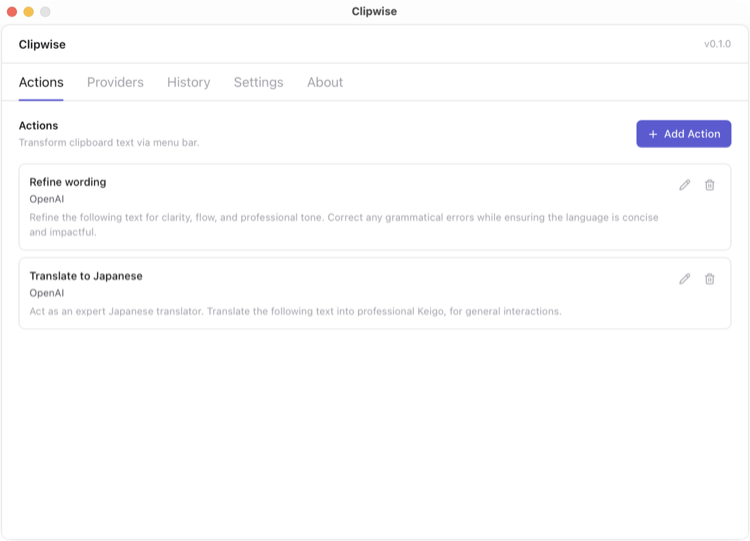
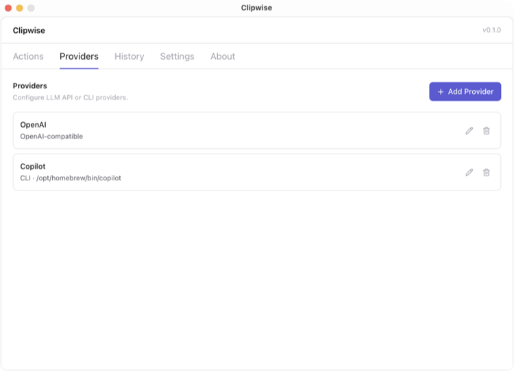
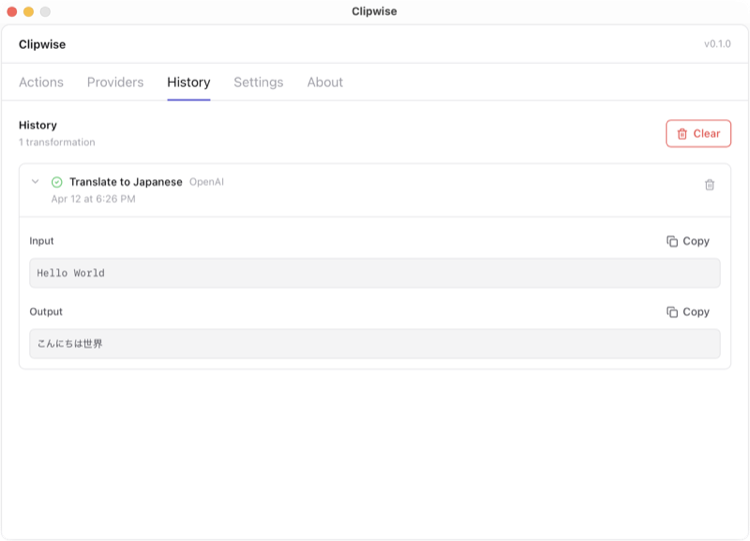
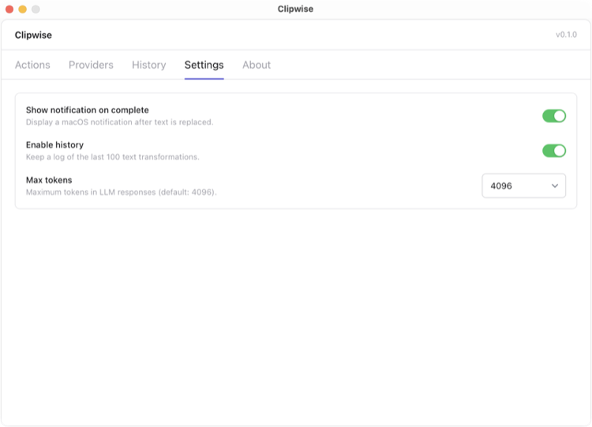
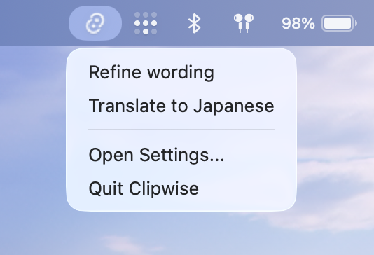

<h1 align="center">Clipwise</h1>

<p align="center">
  <strong>macOS menu bar app for LLM-powered text transformations.</strong>
</p>

<p align="center">
  <a href="https://github.com/andrewmmc/clipwise/actions/workflows/ci.yml">
    
  </a>
  <a href="https://github.com/andrewmmc/clipwise/releases/latest">
    
  </a>
</p>

Clipwise is a small menu bar app that helps you quickly rewrite, summarize, translate, and clean up text anywhere on macOS. Copy text in any app, pick an action from the menu bar, and Clipwise puts the improved result back on your clipboard so you can paste it right away. On Macs that support Apple Intelligence, it can use the built-in on-device model automatically; you can also connect OpenAI-compatible, Anthropic, or local CLI tools.

No browser. No context switching. Select text, run an action, get the result back in your clipboard.

## Screenshots

<p align="center">
  
</p>
<p align="center">
  <strong>Define reusable actions</strong><br />
  Create custom prompt + provider combinations for text transformations like rewriting, translating, and more.
</p>

<table>
  <tr>
    <td width="33%" valign="top">
      
      <p>
        <strong>Manage providers</strong><br />
        Use Apple Intelligence automatically on supported Macs, or connect OpenAI, Anthropic, and local CLI tools like <code>copilot</code> and <code>claude</code>.
      </p>
    </td>
    <td width="33%" valign="top">
      
      <p>
        <strong>Review history</strong><br />
        Browse past transformations with input/output details and quick copy.
      </p>
    </td>
    <td width="33%" valign="top">
      
      <p>
        <strong>Configure settings</strong><br />
        Toggle notifications, enable history, and set max token limits.
      </p>
    </td>
  </tr>
</table>

## Download

**[Download the latest release](https://github.com/andrewmmc/clipwise/releases/latest)**

macOS builds are available for both Apple Silicon (M1+) and Intel.

1. Download the `.dmg` file from the [releases page](https://github.com/andrewmmc/clipwise/releases/latest) for your architecture.
2. Open the `.dmg` and drag **Clipwise** to your **Applications** folder.
3. On first launch, macOS may block the app. Go to **System Settings → Privacy & Security** and click **Open Anyway**.

## How to Use

<p align="center">
  
</p>

1. **Open settings** — launch Clipwise and open the settings window from the menu bar.
2. **Check providers** — if your Mac supports Apple Intelligence, the Apple provider is added automatically. Otherwise add an LLM provider manually (OpenAI-compatible, Anthropic, or a CLI tool).
3. **Create an action** — define a prompt and select a provider (for example, "Refine wording" with Apple Intelligence or OpenAI).
4. **Copy text** — select and copy text in any app.
5. **Run the action** — click the Clipwise icon in the menu bar and select an action.
6. **Paste the result** — the transformed text is written back to your clipboard, ready to paste.

## Why Clipwise

- **System-wide access** — trigger actions from the menu bar in any app without switching context
- **Multi-provider support** — Apple Intelligence on supported Macs, plus OpenAI, Anthropic, any OpenAI-compatible endpoint, and local CLI tools like `claude` or `codex`
- **Custom actions** — define reusable prompt + provider combinations for your specific workflows
- **Local-first** — no backend, no telemetry; on-device Apple Intelligence, API keys, and config stay on your machine

## Features

- **Menu bar app** — runs as a tray app with no Dock presence
- **Settings UI** — manage providers, actions, and app settings from a dedicated window
- **Apple Intelligence support** — auto-attaches the on-device Apple provider when the current Mac supports it
- **Clipboard workflow** — reads text from clipboard, runs the action, writes result back
- **Action testing** — test actions directly in the settings UI before using them
- **Notifications** — optional macOS notifications when actions complete
- **Reorderable actions** — drag to reorder actions in the menu
- **History** — browse past transformations with input/output details

## Providers

Clipwise supports two provider modes:

- **Apple Intelligence** — on supported Macs, Clipwise auto-adds the built-in on-device Apple provider. No API key is required.
- **BYOK / local tools** — for Anthropic, OpenAI-compatible APIs, and CLI tools, you provide your own API keys or local commands. No keys are included or shared. You can get started for free with [OpenRouter's free models](https://openrouter.ai/openrouter/free).
  - **OpenAI-compatible** — works with OpenAI, OpenRouter, local gateways, and other compatible chat completion endpoints
  - **Anthropic** — direct Anthropic API requests
  - **CLI** — local CLI commands like `claude`, `codex`, or custom scripts

## Development

> **Note:** This section is for contributors and developers only.

### Prerequisites

- macOS
- Node.js 22+
- [Rust](https://www.rust-lang.org/tools/install)
- Xcode Command Line Tools

### Quick start

```bash
npm install
npm run tauri:dev    # full Tauri app
```

### Commands

```bash
npm run dev          # Vite dev server only
npm run build        # tsc + Vite build
npm run tauri:dev    # full Tauri app (dev)
npm run tauri:build  # production build
npm run tauri:build-debug  # debug .app bundle
npm run lint         # ESLint
npm run typecheck    # TypeScript check
npm run format       # Prettier
npm test             # Vitest
cd src-tauri && cargo test  # Rust tests
```

### Testing macOS build

To test a built `.app` bundle:

```bash
npm run tauri:build-debug
# Output: src-tauri/target/debug/bundle/macos/Clipwise.app
```

### Tech stack

React 19, TypeScript, Vite 7, Tailwind CSS v4, Tauri 2, Vitest.

See **[AGENTS.md](./AGENTS.md)** for architecture, conventions, and contributor docs.

## Architecture

```text
src/           React + TypeScript settings UI (Vite, Tailwind CSS v4)
src-tauri/     Rust backend: tray app, config persistence, provider calls
```

## Configuration

Config is stored at `~/Library/Application Support/clipwise/config.json`:

```json
{
  "providers": [
    {
      "id": "apple-intelligence",
      "name": "Apple Intelligence",
      "type": "apple"
    }
  ],
  "actions": [],
  "settings": {
    "showNotificationOnComplete": true,
    "maxTokens": 4096,
    "historyEnabled": true
  }
}
```

On Macs without Apple Intelligence support, `providers` may start as an empty array until you add one manually.

## Author

Created by **Andrew Mok** ([@andrewmmc](https://github.com/andrewmmc))

## License

Private. All rights reserved.
